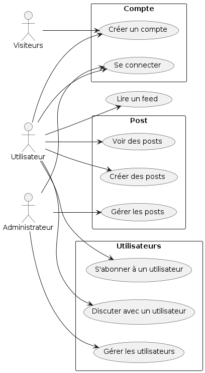
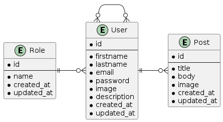
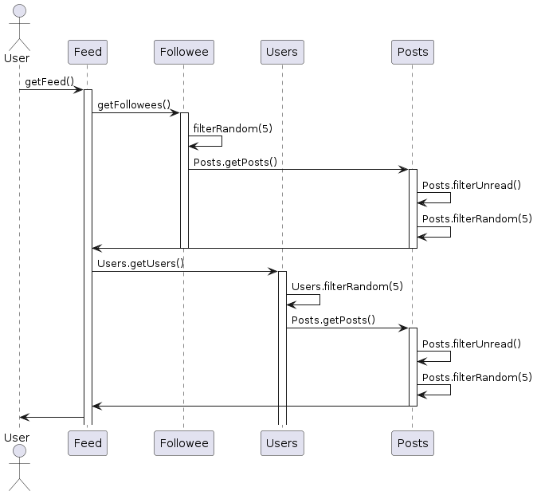
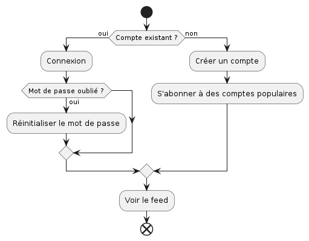

# BSN

Best social network doit devenir le leader dans le domaine. On va reprendre la même base que tous les concurrents. Ce qui nous différenciera reste secret ! Dans ce cahier des charges fonctionnel, nous recherchons une entreprise capable de créer l'architecture de l'application. Elle devra être extrêmement robuste et scallable. On vise le lancement le plus rapide de l'histoire avec 15 milliards de comptes en 1 mois 💪

## Besoins fonctionnels

* Des utilisateurs
* Des posts
* Un feed
* Des abonnements à d'autres utilisateurs
* Des admins

Le feed sera une fonctionnalité novatrice, pour ne rien divulguer on voudrait dans un premier temps un feed simple :

* Pour chaque utilisateur de la plateforme, récupérer les 5 derniers posts.

## Besoins techniques

On sait que nos concurrents utilisent une architecture micro-service et ça fonctionne très bien.

Une fois qu'on aura percé, on aura une équipe de dev sur chaque µservices. D'après nos espions industriels, on aura ces µservices :

* Utilisateurs
* Post
* Intégration (qui agrègera différentes données)
* Autorisation

## Conception

### User stories

* En tant que visiteur, je veux pouvoir m'inscrire sur le réseau social
* En tant qu'utilisateur, je veux pouvoir me connecter sur le réseau social
* En tant qu'utilisateur, je veux pouvoir me déconnecter sur le réseau social
* En tant qu'utilisateur, je veux pouvoir créer un post
* En tant qu'utilisateur, je veux pouvoir voir mon feed
* En tant qu'utilisateur, je veux pouvoir voir le feed d'un autre utilisateur
* En tant qu'utilisateur, je veux pouvoir m'abonner à un autre utilisateur
* En tant qu'utilisateur, je veux pouvoir me désabonner d'un autre utilisateur
* En tant qu'utilisateur, je veux pouvoir voir mon profil
* En tant qu'utilisateur, je veux pouvoir voir le profil d'un autre utilisateur
* En tant qu'utilisateur, je veux pouvoir modifier mon profil
* En tant qu'utilisateur, je veux pouvoir supprimer mon profil
* En tant qu'utilisateur, je veux pouvoir supprimer un post
* En tant qu'utilisateur, je veux pouvoir modifier un post
* En tant qu'administrateur, je veux pouvoir supprimer un utilisateur
* En tant qu'administrateur, je veux pouvoir supprimer un post

### Use cases

```plantuml
include::./assets/usecase.puml[]
```



### ERD

```plantuml
include::./assets/erd.puml[]
```



### Diagramme de séquence

```plantuml
include::./assets/sequence.puml[]
```



### Diagramme d'activité


```plantuml
include::./assets/activity.puml[]
```

